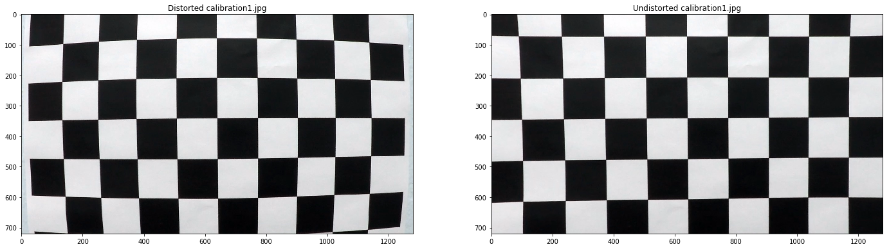
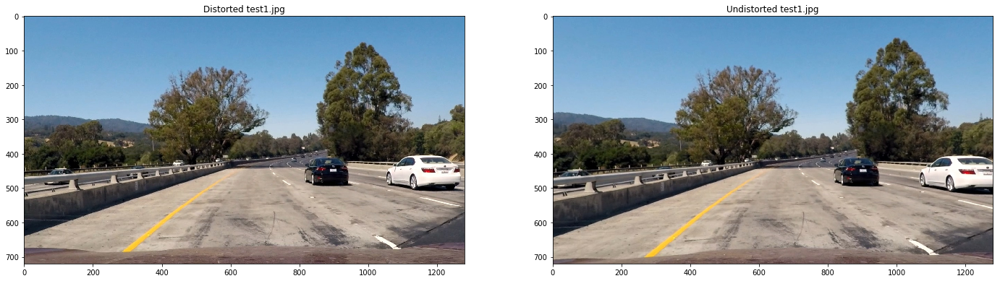
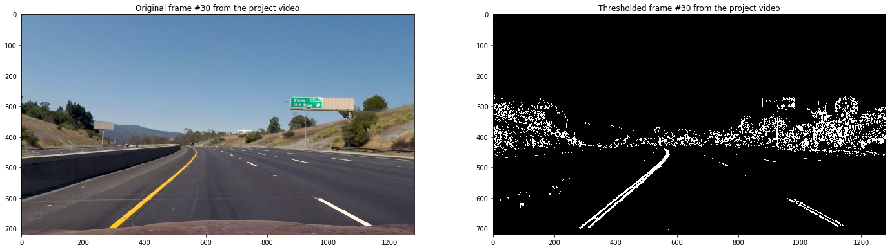
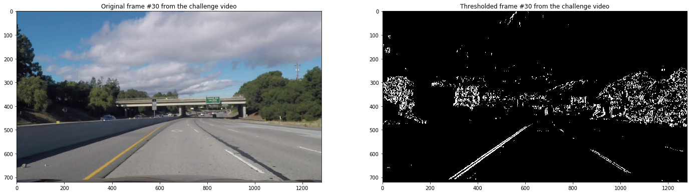
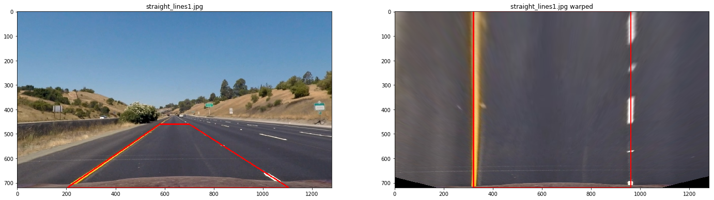
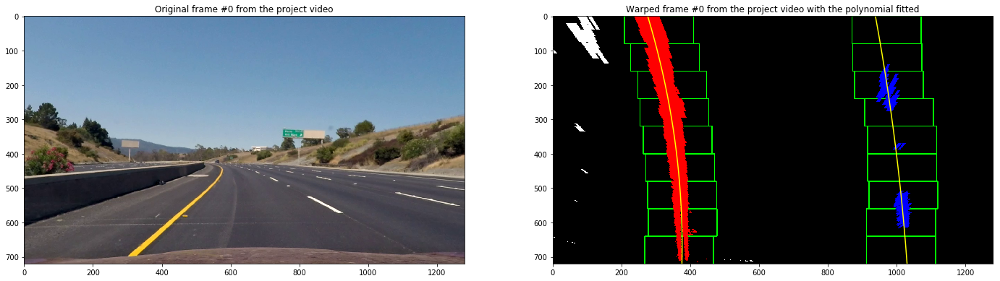
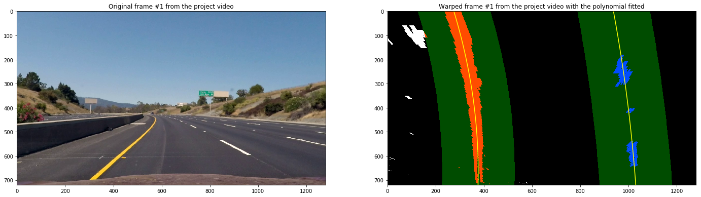
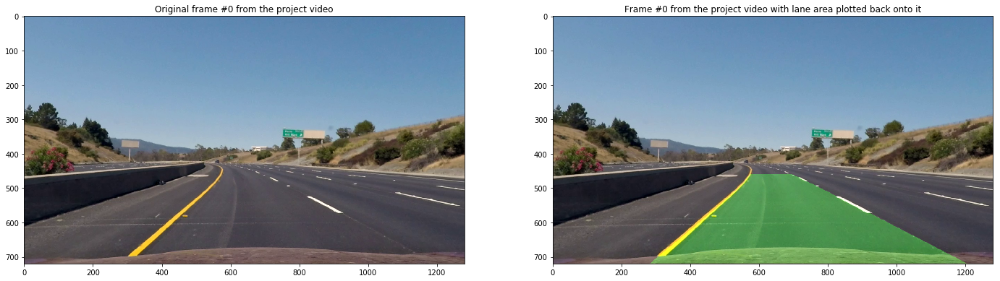

## Advanced Lane Finding
[](http://www.udacity.com/drive)


In this project, your goal is to write a software pipeline to identify the lane boundaries in a video, but the main output or product we want you to create is a detailed writeup of the project.  Check out the [writeup template](https://github.com/udacity/CarND-Advanced-Lane-Lines/blob/master/writeup_template.md) for this project and use it as a starting point for creating your own writeup.  

Creating a great writeup:
---
A great writeup should include the rubric points as well as your description of how you addressed each point.  You should include a detailed description of the code used in each step (with line-number references and code snippets where necessary), and links to other supporting documents or external references.  You should include images in your writeup to demonstrate how your code works with examples.  

All that said, please be concise!  We're not looking for you to write a book here, just a brief description of how you passed each rubric point, and references to the relevant code :).

You're not required to use markdown for your writeup.  If you use another method please just submit a pdf of your writeup.

The Project
---

The goals / steps of this project are the following:

* Compute the camera calibration matrix and distortion coefficients given a set of chessboard images.
* Apply a distortion correction to raw images.
* Use color transforms, gradients, etc., to create a thresholded binary image.
* Apply a perspective transform to rectify binary image ("birds-eye view").
* Detect lane pixels and fit to find the lane boundary.
* Determine the curvature of the lane and vehicle position with respect to center.
* Warp the detected lane boundaries back onto the original image.
* Output visual display of the lane boundaries and numerical estimation of lane curvature and vehicle position.

The images for camera calibration are stored in the folder called `camera_cal`.  The images in `test_images` are for testing your pipeline on single frames.  If you want to extract more test images from the videos, you can simply use an image writing method like `cv2.imwrite()`, i.e., you can read the video in frame by frame as usual, and for frames you want to save for later you can write to an image file.  

To help the reviewer examine your work, please save examples of the output from each stage of your pipeline in the folder called `output_images`, and include a description in your writeup for the project of what each image shows.    The video called `project_video.mp4` is the video your pipeline should work well on.  

The `challenge_video.mp4` video is an extra (and optional) challenge for you if you want to test your pipeline under somewhat trickier conditions.  The `harder_challenge.mp4` video is another optional challenge and is brutal!

If you're feeling ambitious (again, totally optional though), don't stop there!  We encourage you to go out and take video of your own, calibrate your camera and show us how you would implement this project from scratch!

### Camera Calibration

#### 1. Briefly state how you computed the camera matrix and distortion coefficients. Provide an example of a distortion corrected calibration image.

The camera matrix and distortion coefficients were computed by `cv2.calibrateCamera()` function. In order to call that,
we will need a list of object points and image points.

Every image, used for calibration (`./camera_cal/calibration*.jpg`) contains the image of 9x6 chessboard, hence object
points will always be the same for every image - a list of coordinates for every corner of the 9x6 chessboard with the
3rd coordinate (Z) always equal to 0 because the chessboard is flat.

Image points are detected using `cv2.findChessboardCorners()` function and are actual chessboard projections from the camera.


After the `calibrate()` is called on [LaneDetector](lane_detector.py), all the subsequent `unwarp()` calls on that will
use the distortion matrix and coefficients, returned by the `calibrate()` call. Below is the example of applying it
to one of the chessboard calibration images:




The full calibration code can be found in `calibrate()` method of [LaneDetector](lane_detector.py)

### Pipeline (single images)

#### 1. Provide an example of a distortion-corrected image.

To demonstrate this step, I will describe how I apply the distortion correction to one of the test images like this one:


I would read the image from the disk, convert it's color space from BGR to RGB, and finally call `undistort()` on [LaneDetector](lane_detector.py), which simply invokes `cv2.undistort()`, passing the matrix and distortion coefficients, calculated during the calibration step:

```
dist_img = cv2.imread('./test_images/test1.jpg')
dist_img = cv2.cvtColor(dist_img, cv2.COLOR_BGR2RGB)
undist = lane_detector.undistort(dist_img)
```

**The result (side-by-side with the undistorted image) looks like this:**



#### 2. Describe how (and identify where in your code) you used color transforms, gradients or other methods to create a thresholded binary image.  Provide an example of a binary image result.


I used Saturation and Hue channels primarily to detect the yellow lines. Lightness - to detect the white lines. Because thresholding only by color captures a lot of extra noise, the HSL thresholding result is AND-ed with thresholded Sobel (x-direction), gradient magnitude and direction. The thresholded binary image is returned by `binary_image()` method of `LaneDetector` in [LaneDetector](lane_detector.py).

 Here's an example of my output for this step:

**Original vs Thresholded frame #30 from the project video:**


**Original vs Thresholded frame #30 from the challenge video:**


Notice that in the challenge video the darker tar line, going in parallel with the right dashed lane line is not picked up even though it has high gradient magnitude & matching direction. This is because the image is also thresholded by lightness and saturation so the darker / colourless regions (which usually contain little information anyway) are not picked up.

#### 3. Describe how (and identify where in your code) you performed a perspective transform and provide an example of a transformed image.

I used the same approach to calculate the source / destination points as in the example version of this page but with slightly tweaked numbers, which can be found in the `__init__` block of the [LaneDetector](lane_detector.py). Although only transform and inverse transform matrices `M` and `Minv` are required, I have also exposed raw `perspective_transform_src` and `perspective_transform_dst` in order to verify the result by drawing the source and destination points on the test image (used in the "Perspective transform" section of the [project notebook](project.ipynb)). Here's the result:



#### 4. Describe how (and identify where in your code) you identified lane-line pixels and fit their positions with a polynomial?

The lane line pixels are fit to polynomial in `fit_lane_lines()` method of [LaneDetector](lane_detector.py). It it will call `sliding_window_fit()` or `search_around_previous_fit()` depending on whether there is a previous fit or not. `sliding_window_fit()` and `search_around_previous_fit()` are heavily based on the code, presented in the lecture materials.

In order to "amortise" bad fits I have used [Exponential smoothing](https://en.wikipedia.org/wiki/Exponential_smoothing) over previous fits with the smoothing factor (alpha) == 0.85. The value was found experimentally and looked like a good compromise between quick adaptation to the new data (i.e. lane curvature beginning to change) vs not breaking too much on new low-quality fits.

Aside from that, most of other approaches were taken from the lecture materials:
- Create a histogram of the bottom half of the thresholded image and find the peaks in its left and right parts
- Starting from 2 peaks, identified in the previous step, break the image into 9 windows vertically and adjust each window (starting from the bottom) towards the mean position of activated pixels inside that window. Append the pixel indices from each window to the list of left or right lane indices, which will be used to fit the polynomial.
- Fit the polynomial from the data from the previous step.

For example:



For the most part of the pipeline however, the algorithm will not use the sliding window approach and instead search for the lane pixels around the previously fitted curve (`search_around_previous_fit()` method of  [LaneDetector](lane_detector.py))



#### 5. Describe how (and identify where in your code) you calculated the radius of curvature of the lane and the position of the vehicle with respect to center.

I did this in the `calculate_curve_radius()` and `calculate_distance_from_the_lane_center()` methods of [LaneDetector](lane_detector.py). In order to calculate the curvature, I have used the [Curvature radius](https://en.wikipedia.org/wiki/Radius_of_curvature) formula and the supporting code from the lecture. I am taking the average curvature of the left and the right lane.

Calculating the distance from the lane center is trivial - using the currently fitted left and right curve, find the x values (`left_fit_bottom` and `right_fit_bottom`) of the left and right fit at y == 720 (the bottom of the video frame). The average `lane_center` of the `left_fit_bottom` and `right_fit_bottom` is the actual position in the lane. Assuming the camera is mounted in the middle of the car, the center `center_horizontal` is simply the frame width divided by 2. Distance from the center is difference between these 2 values.

#### 6. Provide an example image of your result plotted back down onto the road such that the lane area is identified clearly.

I implemented this step in `unwarp_binary_and_add_to_image()` method of [LaneDetector](lane_detector.py).  Here is an example of my result on a test image:



---

### Pipeline (video)

#### 1. Provide a link to your final video output.  Your pipeline should perform reasonably well on the entire project video (wobbly lines are ok but no catastrophic failures that would cause the car to drive off the road!).

Here's a [link to my project video result](./project_video_processed.mp4)

Here's a [link to my challenge video result](./challenge_video_processed.mp4)

The pipeline performs extremely poorly on the [harder challenge video](./harder_challenge_video.mp4) so that is not included.

---

### Discussion

#### 1. Briefly discuss any problems / issues you faced in your implementation of this project.  Where will your pipeline likely fail?  What could you do to make it more robust?

Here I'll talk about the approach I took, what techniques I used, what worked and why, where the pipeline might fail and how I might improve it if I were going to pursue this project further.

I have mainly used techniques from the lectures.

**What greatly improved the lane detection:**
- Looking for lane pixels around the previous fit instead of using sliding window on every frames
- Using exponential smoothing over the most recent lane line fits, which greatly stabilises the detection on low-quality fits.
- Thresholding both by colour (in the HLS colour space) and by gradient direction and magnitude.

**Where the pipeline might fail:**
- Too light or dark / shadowy roads, where the colour saturation / lightness / gradients are outside of the hard-coded thresholds.
- Twisty roads, like the [harder challenge video](./harder_challenge_video.mp4), where the lane line bends a lot and may even go out of sight.  

**If I were going to pursue this project further, I would:**
- As suggested in the lectures, fallback to the sliding window after N unsuccessful fits around previous fit.
- Attempt to fit different / higher-degree polynomial in order to fit roads with more complex curvature, such as the [harder challenge video](./harder_challenge_video.mp4)
- Adapt the colour / gradient threshold values to the light conditions.
- When fitting the lane line, track the cases when the lane line goes out of view bounds (e.g. very sharp turns).
